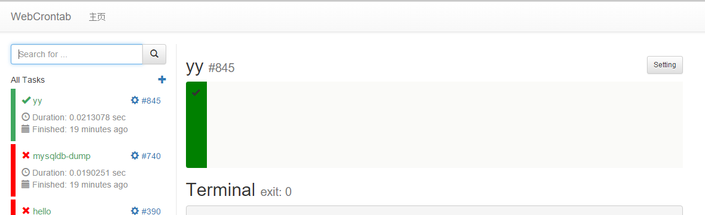

# webcrontab

Web based crontab.

Demo page: <http://webcron.herokuapp.com/>



## Build
```
# Install godep
go get -v github.com/tools/godep

# Build
git clone https://github.com/codeskyblue/webcrontab.git
cd webcrontab
godep go build

# Start
./webcrontab
```

## ChangeLog
- 2015-08-26: First release. Heroku support.

## Contribute
Since the first ok version is released. This really takes me a lot of time, finally get it works. Very happy.

Pull request are welcomed, but make sure code have been tested.

## Thanks
* db engine **xorm**: <https://github.com/go-xorm/xorm>
* <https://github.com/robfig/cron>
* Icon from: <http://www.easyicon.net/516578-schedule_april_icon.html>

## LICENSE
[MIT](LICENSE)
